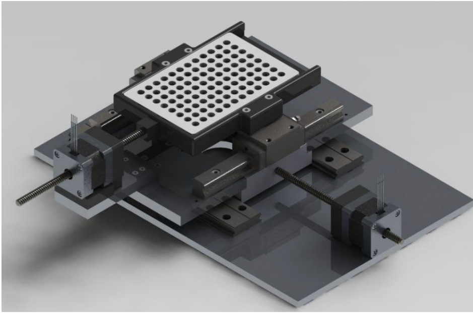
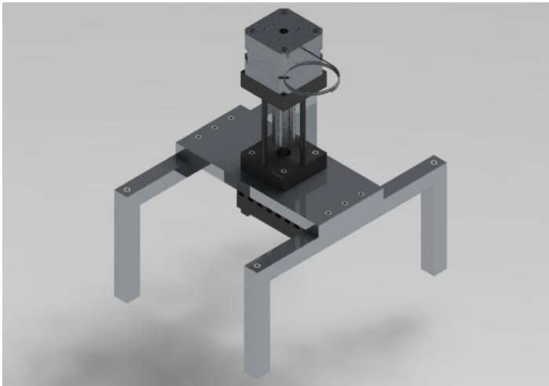
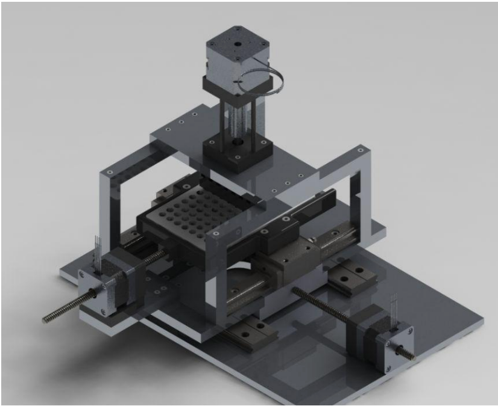

# Automated High-Throughput Virus Detection System

## Introduction

In response to the growing threat of infectious diseases and viruses, especially in the post-Covid-19 era, there is an urgent need for cost-effective, multiplexed, label-free, high-throughput virus detection methods for small single samples. This project aims to design and prototype an automated system that can seamlessly transport and center a standardized microtiter plate's wells in front of a stationary Interferometric Reflectance Imaging Sensor (IRIS) optical system. The system facilitates high-throughput digital measurements of distinct binding events within each well, providing unprecedented sensitivity and resolution.

## Goals Outlined

The project is divided into three phases: research, prototyping, and testing. The research phase involves studying methods for positioning microtiter plates and exploring techniques for inserting IRIS chips into the plates. The findings are then used to create a 3D model of the design using SolidWorks. The prototyping phase optimizes the CAD model based on feedback and constructs a proof of concept. Finally, the testing phase focuses on reliability testing of the prototype assembly, including repeatability tests for plate positioning and evaluating the consistency of the dipping mechanism.

## Proposed Design

The proposed design integrates two systems: an XY positioning system and a dipping mechanism.

### XY Positioning System

The XY positioning system uses two pairs of rails and non-capacitive stepper motors to move a 96-well microtiter plate with high precision. The motors push the plate along two perpendicular axes, allowing the IRIS optical system to focus on the selected well. An Arduino, alongside a stepper motor driver, controls the motors. The wiring diagram for this setup is provided in Figure 2.

### Dipping Mechanism

The dipping mechanism facilitates the insertion and cleaning of IRIS chips in the microtiter plate. A specialized part called the "buckle" holds the IRIS chip and is attached to a 3D-printed holder with eight buckles, each equipped with springs to provide a cushion when the IRIS chip contacts the microtiter plate. A linear actuator facilitates the insertion and retraction of the IRIS chips. The entire assembly is illustrated in Figure 4.

## Cleaning IRIS Chips

To clean the IRIS chips, half of the wells in the microtiter plate are designated for cleaning, while the other half is used for sampling. This arrangement allows the system to sequentially sample eight samples in a column, clean itself, and then proceed to resample.

## System Overview

The complete system, comprising the XY positioning system and dipping mechanism, is depicted below in Figure 5.

For a detailed bill of materials, refer to the [Appendix](appendix/bill_of_materials.md).
